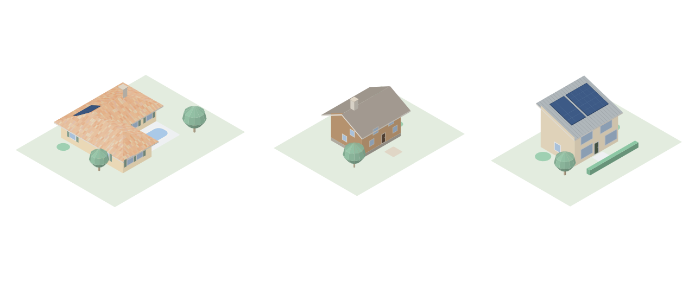
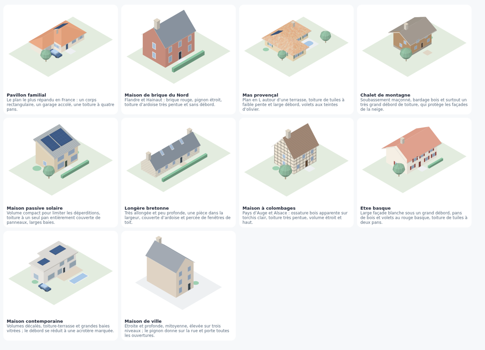
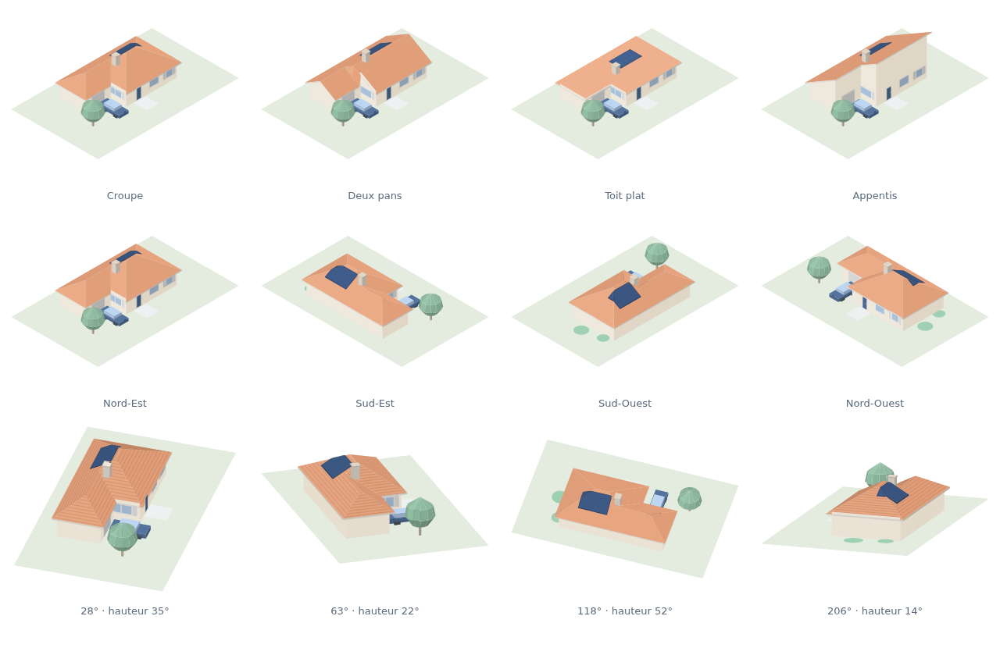
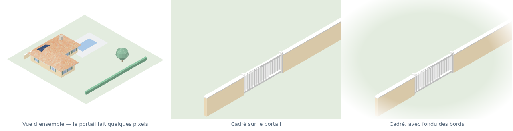

# Isometric House Builder

Modélisez votre maison en vue isométrique et exportez-en des illustrations
PNG ou SVG, prêtes à être posées sur un tableau de bord domotique.



**[▶ Ouvrir l'application](https://guim31.github.io/isometric-house-builder/)** —
rien à installer, tout se passe dans le navigateur, aucune donnée n'est envoyée
nulle part.

---

## Pourquoi cet outil

Il existe déjà d'excellents constructeurs de maisons isométriques, mais ils sont
soit payants, soit fermés, soit pensés pour le jeu plutôt que pour produire une
image réutilisable. Celui-ci a trois partis pris :

- **Libre et gratuit**, sous licence MIT, sans compte ni téléversement.
- **L'image est le produit fini.** Export PNG à fond transparent et jusqu'en 4×,
  export SVG vectoriel, et les quatre faces de la maison en un clic.
- **Aucune étape de construction.** Ni Node, ni bundler, ni dépendance : des
  modules ES et un fichier `index.html`. On clone, on ouvre, ça marche — et
  n'importe qui peut lire le code sans outillage.

Conçu au départ pour illustrer une maison dans
[Gladys Assistant](https://gladysassistant.com/), mais l'export est du PNG et du
SVG ordinaires : Home Assistant, Jeedom, un wiki ou une présentation feront tout
aussi bien l'affaire.

## Dix modèles pour démarrer



L'outil s'ouvre sur une galerie plutôt que sur une grille vide. Les dix modèles
couvrent des architectures volontairement contrastées — pavillon, brique du
Nord, mas provençal, chalet, maison passive, longère, colombages, etxe basque,
contemporaine, maison de ville — parce que ce qui distingue une région tient
davantage à la pente du toit, à la profondeur du débord et au nombre de niveaux
qu'à la couleur des murs. Prenez le plus proche du vôtre et remodelez-le : c'est
plus rapide que de partir de rien. Le bouton **Modèles** rouvre la galerie à
tout moment, et *Page blanche* reste disponible.

## Ce que l'outil sait faire



| | |
|---|---|
| **Volumes** | Plusieurs **corps de bâtiment indépendants** — maison, garage, abri de jardin — chacun avec sa toiture, sa hauteur, ses matières et ses couleurs |
| **Volume** | Emprise dessinée à main levée sur une trame de 1 m ou 0,50 m, jusqu'à 4 niveaux, hauteur d'étage et soubassement réglables |
| **Cotes** | Longueur affichée sur chaque pan de mur, dimensions en direct pendant le tracé, emprise et surface dans l'inspecteur |
| **Toiture** | Croupe, deux pans, appentis, toit plat — inclinaison, débord et épaisseur de rive ; les noues entre ailes sont calculées |
| **Ouvertures** | Fenêtres, fenêtres à volets, portes, portes de garage, posées sur n'importe quel mur et à n'importe quel niveau |
| **Sur le toit** | Panneaux photovoltaïques, cheminées, fenêtres de toit, paraboles — posés à plat sur la pente |
| **Extérieurs** | Piscine, terrasse, allée, pelouse, haies, clôtures, arbres, buissons, voiture — terrasses et piscines pouvant être **surélevées**, avec leurs joues |
| **Clôture** | **Muret** tracé au glisser, avec chaperon ; **portillon** battant et **portail coulissant**, qui ouvrent le muret là où on les pose |
| **Matières** | Tuiles, **tuiles canal panachées**, ardoises, bac acier sur le toit ; briques, bardage, pierre, colombages sur les murs — dessinées dans le plan de chaque face, donc elles suivent réellement la pente |
| **Couleurs** | 6 palettes, dont deux reprenant le thème **Horizons de Gladys v5**, puis chaque matériau recolorable individuellement |
| **Rendu** | Contours, ombre portée, projection isométrique 30° ou dimétrique 2:1 |
| **Caméra** | **Orbite libre** : on fait tourner la maison à la souris, sur 360° et de la vue rasante à la quasi-verticale — les quatre faces restent à un clic |
| **Cadrage** | Une zone dessinée sur le plan devient l'export : ce qui est hors zone disparaît, les bords s'estompent en fondu, et chaque cadrage se garde comme **vue nommée** |
| **Export** | PNG 1×/2×/4× à fond transparent, SVG, les 4 faces en lot, toutes les vues enregistrées en lot, copie directe dans le presse-papier |

## Cadrer sur une zone



Un widget qui pilote **un seul** appareil ne gagne rien à montrer toute la
propriété : le portail y fait quelques pixels. L'outil *Zone de cadrage* trace
un rectangle sur le plan ; l'export s'y recadre, et ce qui tombe en dehors est
**retiré** plutôt que simplement mis hors champ.

Cette distinction n'est pas cosmétique : en isométrie, la distance au sol n'est
pas la distance à l'écran. Un abri au fond du jardin se projette *vers le haut*,
en plein dans un cadre serré sur le portail — resserrer la caméra le rapproche
au lieu de l'écarter. D'où le retrait pur et simple.

Le retrait porte sur des éléments entiers, jamais sur des morceaux : une haie
qui entre dans le cadre y reste tout entière, parce qu'une demi-haie finissant
en l'air est un défaut pire qu'une haie qui sort de l'image. Le **fondu des
bords** adoucit ensuite la coupe. Il s'applique à l'image composée, non à chaque
face : estomper les faces une par une rendrait la maison transparente à
elle-même, et on lirait le mur du fond au travers du mur de devant.

Chaque cadrage se garde comme **vue nommée** — un portail, une piscine, une vue
d'ensemble — et le bouton *Vues enregistrées* de la fenêtre d'export les
régénère toutes en une passe quand la maison change.

## Prise en main

1. **Partez d'un modèle** proche du vôtre, puis **corrigez l'emprise** : outil
   *Rectangle* pour poser un volume, *Pinceau* pour affiner, *Gomme* pour
   retirer. Chaque pan de mur affiche sa longueur, et l'outil *Rectangle*
   montre les dimensions pendant le tracé. La trame vaut 1 m par défaut ;
   passez-la à **0,50 m** (panneau *Bâtiment*) pour caler les dimensions
   réelles de votre maison — l'emprise existante est conservée à l'identique,
   ouvertures comprises.
2. **Réglez la toiture** dans le panneau de droite. Le débord se cale par pas de
   25 cm, pour que la rive tombe sur la trame.
3. **Choisissez matières et couleurs** dans *Couleurs et matières* : une palette
   de départ, une matière de toit et de murs, puis autant de retouches
   individuelles que vous voulez. Changer de palette applique aussi le style
   qu'elle suppose — *Horizons* se passe de contours et de soubassement, c'est
   ce qui fait son allure.
4. **Posez les ouvertures.** Choisissez *Fenêtre*, *Porte* ou *Porte de garage*,
   puis cliquez le long d'un mur — dans le plan, ou directement sur le rendu.
5. **Ajoutez d'autres corps** si besoin (bouton *Nouveau corps de bâtiment*) :
   chacun se dessine et se règle séparément, et cliquer un volume dans le plan
   le rend actif. C'est ainsi qu'un abri de jardin reçoit un toit plat pendant
   que la maison garde ses tuiles.
6. **Aménagez les abords** avec les outils *Extérieur*. Muret, clôture et haie
   se **tracent au glisser**, leur longueur s'affichant pendant le tracé ; un
   portail posé près d'un muret s'y aligne et l'ouvre automatiquement.
7. **Choisissez votre angle** en glissant directement dans le rendu, comme on
   manipule un modèle 3D : horizontalement pour tourner, verticalement pour
   monter ou descendre la caméra. Les boutons `↺` `↻` ramènent aux quatre
   faces, et le panneau *Vue* donne les mêmes réglages au degré près.
8. **Cadrez si besoin** avec l'outil *Zone de cadrage*, puis enregistrez la vue
   pour la retrouver et la réexporter plus tard.
9. **Exportez.** Le fond transparent est celui à préférer : l'image se pose alors
   sur n'importe quelle couleur de tableau de bord.

À savoir : la vue par défaut regarde les façades **nord et est**. Si vos
ouvertures semblent absentes, elles sont probablement sur les deux façades
opposées — tournez la vue avec `[` et `]`.

Raccourcis : `Ctrl+Z` / `Ctrl+Maj+Z` annuler et rétablir, `Ctrl+D` dupliquer la
sélection, `[` et `]` tourner d'un quart de tour, `Suppr` supprimer, `Échap`
désélectionner. Dans le rendu, **glisser fait pivoter** la maison ; la molette
zoome autour du curseur, le pincement à deux doigts fonctionne sur écran
tactile, et `Maj` + glisser déplace la vue — quel que soit l'outil actif.
Dans le plan, une ouverture sélectionnée **coulisse le long des murs** quand on
la fait glisser ; les éléments d'extérieur se posent aussi d'un clic
directement sur le rendu. Une boussole dans chaque vue rappelle où est le nord.

Le projet en cours est conservé dans le navigateur. *Enregistrer* produit un
fichier `.house.json` lisible et versionnable, qu'*Ouvrir* relit ; c'est aussi
le format des dix modèles de départ, décrits dans
[`src/data/presets.js`](src/data/presets.js). *Partager* copie un lien qui
encode tout le projet dans l'URL — rien ne transite par un serveur.

## Intégrer l'image à Gladys Assistant

Gladys v5 embarque un widget **Vue de la maison** (*house-view*) qui propose
quatre illustrations isométriques toutes faites — et qui accepte surtout **votre
propre image**, sur laquelle vous pouvez ensuite poser des **pastilles liées à
vos appareils**. C'est précisément ce que cet outil sert à produire.

1. Choisissez la palette **Horizons** (celle par défaut) : elle reprend les
   couleurs exactes de la galerie de Gladys, pour que votre maison ne détonne
   pas à côté du reste du tableau de bord.
2. Exportez en **PNG, fond transparent**, taille **Gladys — 2560 × 1600**.
3. Dans Gladys : ajoutez un widget *Vue de la maison*, **téléversez l'image**,
   puis cliquez dessus pour poser vos pastilles.

Sur la taille, une précision qui évite de perdre en netteté : Gladys ramène
toute image à **2560 px de grand côté** et ne la ré-encode pas si elle pèse
moins de 2 Mo. Exporter en 4× (4800 px) donne donc une image *moins* nette
qu'en 2560, puisqu'elle sera rééchantillonnée à l'arrivée. Le préréglage
*Gladys* vise exactement ce plafond.

Rien n'empêche par ailleurs d'utiliser une simple carte **Image**, ou un tout
autre logiciel : la sortie reste du PNG et du SVG ordinaires. Le SVG est du
vectoriel plat, sans filtre ni police, éditable dans n'importe quel éditeur —
le seul dégradé est le masque du fondu des bords, et il n'apparaît que si vous
l'avez demandé.

## Développement

Aucune dépendance à installer. Un serveur statique suffit, car les modules ES ne
se chargent pas depuis `file://` :

```bash
git clone https://github.com/guim31/isometric-house-builder.git
cd isometric-house-builder
python3 -m http.server 8000
# puis http://localhost:8000/
```

La suite de tests s'exécute dans le navigateur — ouvrez
<http://localhost:8000/tests/> — ou en ligne de commande avec Chrome :

```bash
./dev/run-tests.sh
```

### Comment c'est construit

Trois décisions portent tout le reste, et valent d'être connues avant de
modifier le moteur :

- **La profondeur vaut exactement `x + y + λ·z`, et c'est ce qui rend l'orbite
  libre possible.** En résolvant « quelle direction du monde ne déplace rien à
  l'écran » pour la projection, on trouve l'axe de vue `(1, 1, λ)`, avec
  `λ = 2·ky/kz` — une forme linéaire, quel que soit l'angle. Trier les faces
  dessus est *exact*, et pas seulement plausible, parce que la géométrie est
  faite de boîtes alignées sur les axes : deux volumes disjoints ont toujours un
  plan séparateur perpendiculaire à un axe du monde, et l'axe de vue a une
  composante non nulle sur cet axe. Les seules exceptions sont les quatre lacets
  où la caméra regarde droit dans un axe ; la composante s'y annule, mais un
  décalage le long de cet axe devient alors une simple translation à l'écran,
  donc les volumes qu'il sépare ne peuvent de toute façon pas se masquer. C'est
  pourquoi aucun angle n'a besoin d'être interdit — sauf en hauteur, où une
  caméra à l'horizontale annulerait la composante verticale et cesserait de
  ranger une cheminée au-dessus de son toit.
- **La toiture est l'enveloppe supérieure d'un toit élémentaire par rectangle.**
  L'emprise est décomposée en rectangles maximaux — qui ont le droit de se
  chevaucher — et le toit est le maximum de leurs surfaces. C'est ce qui produit
  les noues correctes là où deux ailes se rejoignent. Les murs, eux, montent
  jusqu'à la sous-face du toit : un pignon n'est pas une pièce à part, c'est une
  conséquence.
- **Un corps de bâtiment porte sa propre toiture.** Un abri de jardin n'est pas
  la maison en plus petit : il a son toit plat et son bardage. Le modèle porte
  donc une liste de volumes, chacun avec sa hauteur, sa toiture et, s'il le
  souhaite, ses matières et ses couleurs — celles-ci se distinguant par un
  suffixe (`wall#abri`) plutôt que par une palette entière par volume. À
  l'ouverture d'un ancien fichier, les parties non contiguës de l'emprise
  deviennent des corps distincts : elles l'étaient déjà, elles n'avaient
  simplement aucun moyen de le dire.
- **Un portail n'est pas rattaché à un muret, il le recoupe.** Le muret est
  reconstruit en tronçons de part et d'autre de tout portail qui l'enjambe,
  plutôt que de tenir une liste d'ouvertures. Poser un portail, le faire
  glisser le long du muret ou le supprimer fait donc ce qu'on attend, sans
  relation à maintenir entre deux objets.
- **Ce qui est posé sur une surface se range derrière celle qui le recouvre
  réellement.** Un objet de toiture était rattaché au plan de toit le plus
  proche, si bien qu'une cheminée près d'un faîtage s'ancrait à un versant
  pendant que l'autre, dessiné après, la coupait en deux. Le porteur est
  désormais choisi par recouvrement à l'écran, ce qui donne la bonne réponse
  aussi bien au faîtage qu'en bas de pente.
- **Les éléments linéaires sont émis en tronçons.** Une haie ou un muret de
  vingt mètres fusionné en une seule face n'a qu'un centre, donc qu'une
  profondeur : le tout passe devant la maison ou derrière, jamais en partie
  l'un et en partie l'autre. Les tronçons se recouvrent d'un cheveu, faute de
  quoi l'anticrénelage laisse voir la jointure.
- **Les aménagements au sol se superposent dans un ordre fixe.** Terrasse,
  margelle et eau sont de grandes faces quasi coplanaires : leur profondeur de
  peintre dépend de leur position au sol, pas des millimètres qui les séparent
  en hauteur, si bien qu'une piscine au fond d'une terrasse passait dessous.
  Elles sont donc empilées explicitement, comme le plan de sol l'était déjà.
  Surélevée, une dalle redevient de la géométrie ordinaire — et s'ancre alors à
  ce qui la porte, la chaîne se propageant de l'eau à sa margelle puis à la
  terrasse.
- **Une palette peut nommer une couleur par orientation.** Certaines, dont
  Horizons, décalent la teinte dans l'ombre au lieu d'en baisser seulement la
  valeur : aucun assombrissement d'une couleur unique ne les reproduit. Les
  faces d'axe reçoivent donc la teinte exacte, les faces inclinées une
  interpolation. Recolorer un matériau applique un rapport par canal, ce qui
  préserve cette structure au lieu de retomber sur une multiplication à plat.
- **Le panachage des tuiles canal est déterministe.** Chaque tuile tire sa
  nuance d'un hachage de sa propre position, jamais d'un tirage aléatoire :
  l'export correspond exactement à l'aperçu, et réexporter demain redonne la
  même image. Les nuances forment une palette fixe d'une vingtaine de tons, ce
  qui permet d'émettre un chemin par teinte au lieu d'un par tuile — quelques
  milliers de facettes tiennent ainsi en une vingtaine de chemins.
- **Les matières sont générées dans le plan de la face, pas en motif SVG.** Un
  `<pattern>` vit dans l'espace de l'écran : les rangs de tuiles seraient
  identiques sur tous les pans et la texture semblerait collée sur l'image. Ici
  les lignes sont tracées en coordonnées réelles puis projetées, et découpées
  par la face elle-même.
- **La géométrie est émise en triangles fins, puis refusionnée.** `mesh.js`
  recombine les triangles coplanaires de même matériau en polygones, en séparant
  les composantes connexes. Sans cette séparation, deux objets coplanaires
  distincts partageraient un centre — donc une profondeur — et l'un traverserait
  la maison.

| Fichier | Rôle |
|---|---|
| `src/core/iso.js` | Projection, orbite, profondeur, ajustement de la caméra |
| `src/core/focus.js` | Zone de cadrage : ce qui est montré, ce qui est retiré |
| `src/core/grid.js` | Emprise, murs extérieurs, décomposition en rectangles |
| `src/core/roof.js` | Champ de hauteur et maillage de la toiture |
| `src/core/mesh.js` | Fusion des faces coplanaires, trous, composantes |
| `src/core/scene.js` | Assemblage : sol, murs, ouvertures, toit, objets |
| `src/render/svg.js` | Tri, éclairage, émission SVG |
| `src/core/palette.js` | Palettes, ancrages par orientation, éclairage |
| `src/data/presets.js` | Les dix modèles de départ |
| `src/render/texture.js` | Rangs de tuiles, appareillages, bardages |
| `src/render/hit.js` | Couche de sélection invisible |
| `src/ui/` | Plan, rendu, inspecteur, galerie, historique |
| `src/ui/actions.js` | Pose des ouvertures, objets de toit et extérieurs, partagée par les deux vues |
| `src/io/` | Export image, fichiers de projet, lien de partage |

Les contributions sont bienvenues : ouvrez une issue ou une pull request.
Merci de faire passer `./dev/run-tests.sh` avant de proposer un changement.

## Licence

MIT — voir [LICENSE](LICENSE). Faites-en ce que vous voulez, y compris
commercialement.

---

<details>
<summary><b>English summary</b></summary>

**Isometric House Builder** is a free, open-source, build-step-free web tool for
modelling the exterior of a house in isometric view and exporting it as a
transparent PNG or a flat SVG — meant for home-automation dashboards such as
Gladys Assistant, but the output is plain image files usable anywhere.

It opens on a gallery of ten starter houses — French regional archetypes from a
Flemish brick townhouse to a Provençal mas, a mountain chalet and a passive
solar home — so you begin by adjusting something close to your own rather than
from an empty grid.

Draw the footprint on a one-metre grid, pick a roof (hip, gable, shed, flat),
place windows, doors, garage doors, solar panels, chimneys, a pool, trees, then
export the current view or all four isometric orientations at once.

The default palette matches the **Horizons** theme of Gladys Assistant v5, so an
exported house drops straight into its *house-view* widget — which accepts a
custom image and lets you pin device features onto it. Export at the *Gladys*
preset (2560 px): the app downscales anything larger.

No dependencies, no bundler, no account: clone it, serve the folder, open
`index.html`. Roof and wall materials are generated in world space and projected, so courses follow each slope. Tests live in `tests/` and run in the browser, or headlessly via
`./dev/run-tests.sh`. MIT licensed.

</details>
